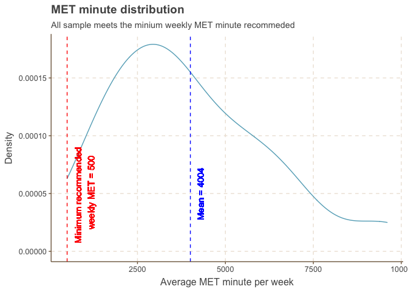

Bellabeat Marketing Fitness Tracker Usage Case Study
================
Eric Chan
3/2/2022

``` r
knitr::opts_chunk$set(
  fig.path = "figure/fig-")
```

# Case background

This is the capstone project of the Google Data Analytics Professional
Certificate.

Bellabeat, a health focus company for women, is looking to enter the
global smart device market. The founder believes analysing smart device
fitness data could unlock new growth opportunities.

<https://bellabeat.com>

I have been asked to analyse smart device data to gain insight on how
consumers are using their device, and provide high-level recommendations
for Bellabeat’s marketing strategy.

# 1. Ask

## Business Tasks

-   Find the average exercise level (MET minute), and exercise duration
    per week. Suggest marketing persona for content marketing.

-   Find the peak time of exercising during a day, and during a week.
    Provides suggestion on timing on social media marketing post, and
    premium membership events.

-   Find sleep efficiency in the group, correlations between sleep
    efficiency and other factors. Suggests types of content and event
    the marketing team could provides to increase customer loyalty and
    conversion of premium membership.

## Key stakeholders

-   Urška Sršen, Co-founder
-   Sando Mur, Co-founder
-   Bellabeat marketing analytics team

# 2. Prepare

## Description of data source used

The specific dataset used is the FitBit Fitness Tracker Data (CC0:
Public Domain, through Kaggle Mobius).

-   Reliability – Second-party data, collected by Kaggle user Möbius who
    is a data scientist.

-   Original – Data is generated by respondents of a survey distributed
    via Amazon Mechanical Turk between 12 Mar 2016 to 12 May 2016. CSV
    files in the dataset are transformed and merged.

-   Comprehensive – Includes minute-level output for physical activity,
    heart rate, and sleep monitoring.

-   Not current – Data was collected in 2016. Users may have different
    usage patterns e.g. hybrid work has appeared.

-   Cited – Usability score on Kaggle is 10.

Dataset URL <https://www.kaggle.com/arashnic/fitbit>

Metadata PDF - Data descriptions
<https://www.fitabase.com/media/1930/fitabasedatadictionary102320.pdf>

Fitbit - How activity, steps, distance etc are collected
<https://help.fitbit.com/articles/en_US/Help_article/1141.htm>

Fitbit - How sleeps are tracked
<https://help.fitbit.com/articles/en_US/Help_article/1314.htm>

## Import data

``` r
# Install packages
install.packages("tidyverse", repos = "http://cran.us.r-project.org")
```

    ## 
    ## The downloaded binary packages are in
    ##  /var/folders/q2/hkxc299n7rz86s28bfjzh63r0000gn/T//RtmpgdcsBI/downloaded_packages

``` r
install.packages("lubridate", repos = "http://cran.us.r-project.org")
```

    ## 
    ## The downloaded binary packages are in
    ##  /var/folders/q2/hkxc299n7rz86s28bfjzh63r0000gn/T//RtmpgdcsBI/downloaded_packages

``` r
install.packages("hms", repos = "http://cran.us.r-project.org")
```

    ## 
    ## The downloaded binary packages are in
    ##  /var/folders/q2/hkxc299n7rz86s28bfjzh63r0000gn/T//RtmpgdcsBI/downloaded_packages

``` r
install.packages("skimr", repos = "http://cran.us.r-project.org")
```

    ## 
    ## The downloaded binary packages are in
    ##  /var/folders/q2/hkxc299n7rz86s28bfjzh63r0000gn/T//RtmpgdcsBI/downloaded_packages

``` r
install.packages("janitor", repos = "http://cran.us.r-project.org")
```

    ## 
    ## The downloaded binary packages are in
    ##  /var/folders/q2/hkxc299n7rz86s28bfjzh63r0000gn/T//RtmpgdcsBI/downloaded_packages

``` r
install.packages("scales", repos = "http://cran.us.r-project.org")
```

    ## 
    ## The downloaded binary packages are in
    ##  /var/folders/q2/hkxc299n7rz86s28bfjzh63r0000gn/T//RtmpgdcsBI/downloaded_packages

``` r
install.packages("multimode", repos = "http://cran.us.r-project.org")
```

    ## 
    ## The downloaded binary packages are in
    ##  /var/folders/q2/hkxc299n7rz86s28bfjzh63r0000gn/T//RtmpgdcsBI/downloaded_packages

``` r
# Load packages 
library(tidyverse)
```

    ## ── Attaching packages ─────────────────────────────────────── tidyverse 1.3.1 ──

    ## ✓ ggplot2 3.3.5     ✓ purrr   0.3.4
    ## ✓ tibble  3.1.6     ✓ dplyr   1.0.8
    ## ✓ tidyr   1.2.0     ✓ stringr 1.4.0
    ## ✓ readr   2.1.2     ✓ forcats 0.5.1

    ## ── Conflicts ────────────────────────────────────────── tidyverse_conflicts() ──
    ## x dplyr::filter() masks stats::filter()
    ## x dplyr::lag()    masks stats::lag()

``` r
library(lubridate)
```

    ## 
    ## Attaching package: 'lubridate'

    ## The following objects are masked from 'package:base':
    ## 
    ##     date, intersect, setdiff, union

``` r
library(hms)
```

    ## 
    ## Attaching package: 'hms'

    ## The following object is masked from 'package:lubridate':
    ## 
    ##     hms

``` r
library(skimr)
library(janitor)
```

    ## 
    ## Attaching package: 'janitor'

    ## The following objects are masked from 'package:stats':
    ## 
    ##     chisq.test, fisher.test

``` r
library(scales)
```

    ## 
    ## Attaching package: 'scales'

    ## The following object is masked from 'package:purrr':
    ## 
    ##     discard

    ## The following object is masked from 'package:readr':
    ## 
    ##     col_factor

``` r
library(multimode)

# Install ggthemr package
# Apply to all plots
library(devtools)
```

    ## Loading required package: usethis

``` r
devtools::install_github('Mikata-Project/ggthemr')
```

    ## Skipping install of 'ggthemr' from a github remote, the SHA1 (4a31e0df) has not changed since last install.
    ##   Use `force = TRUE` to force installation

``` r
library(ggthemr)
ggthemr('fresh')
```

``` r
# Import datasets
dailyActivity_raw <- read_csv("input/dailyActivity_merged.csv")
```

    ## Rows: 940 Columns: 15
    ## ── Column specification ────────────────────────────────────────────────────────
    ## Delimiter: ","
    ## chr  (1): ActivityDate
    ## dbl (14): Id, TotalSteps, TotalDistance, TrackerDistance, LoggedActivitiesDi...
    ## 
    ## ℹ Use `spec()` to retrieve the full column specification for this data.
    ## ℹ Specify the column types or set `show_col_types = FALSE` to quiet this message.

``` r
minuteMET_raw <- read_csv("input/minuteMETsNarrow_merged.csv")
```

    ## Rows: 1325580 Columns: 3
    ## ── Column specification ────────────────────────────────────────────────────────
    ## Delimiter: ","
    ## chr (1): ActivityMinute
    ## dbl (2): Id, METs
    ## 
    ## ℹ Use `spec()` to retrieve the full column specification for this data.
    ## ℹ Specify the column types or set `show_col_types = FALSE` to quiet this message.

``` r
dailySleep_raw <- read_csv("input/sleepDay_merged.csv")
```

    ## Rows: 413 Columns: 5
    ## ── Column specification ────────────────────────────────────────────────────────
    ## Delimiter: ","
    ## chr (1): SleepDay
    ## dbl (4): Id, TotalSleepRecords, TotalMinutesAsleep, TotalTimeInBed
    ## 
    ## ℹ Use `spec()` to retrieve the full column specification for this data.
    ## ℹ Specify the column types or set `show_col_types = FALSE` to quiet this message.

``` r
hourlyIntensity_raw <- read_csv("input/hourlyIntensities_merged.csv")
```

    ## Rows: 22099 Columns: 4
    ## ── Column specification ────────────────────────────────────────────────────────
    ## Delimiter: ","
    ## chr (1): ActivityHour
    ## dbl (3): Id, TotalIntensity, AverageIntensity
    ## 
    ## ℹ Use `spec()` to retrieve the full column specification for this data.
    ## ℹ Specify the column types or set `show_col_types = FALSE` to quiet this message.

``` r
dailyCalories_raw <- read_csv("input/dailyCalories_merged.csv")
```

    ## Rows: 940 Columns: 3
    ## ── Column specification ────────────────────────────────────────────────────────
    ## Delimiter: ","
    ## chr (1): ActivityDay
    ## dbl (2): Id, Calories
    ## 
    ## ℹ Use `spec()` to retrieve the full column specification for this data.
    ## ℹ Specify the column types or set `show_col_types = FALSE` to quiet this message.

``` r
weight_raw <- read_csv("input/weightLogInfo_merged.csv")
```

    ## Rows: 67 Columns: 8
    ## ── Column specification ────────────────────────────────────────────────────────
    ## Delimiter: ","
    ## chr (1): Date
    ## dbl (6): Id, WeightKg, WeightPounds, Fat, BMI, LogId
    ## lgl (1): IsManualReport
    ## 
    ## ℹ Use `spec()` to retrieve the full column specification for this data.
    ## ℹ Specify the column types or set `show_col_types = FALSE` to quiet this message.

## Explore datasets

``` r
head(dailyActivity_raw)
```

    ## # A tibble: 6 × 15
    ##        Id ActivityDate TotalSteps TotalDistance TrackerDistance LoggedActivitie…
    ##     <dbl> <chr>             <dbl>         <dbl>           <dbl>            <dbl>
    ## 1  1.50e9 4/12/2016         13162          8.5             8.5                 0
    ## 2  1.50e9 4/13/2016         10735          6.97            6.97                0
    ## 3  1.50e9 4/14/2016         10460          6.74            6.74                0
    ## 4  1.50e9 4/15/2016          9762          6.28            6.28                0
    ## 5  1.50e9 4/16/2016         12669          8.16            8.16                0
    ## 6  1.50e9 4/17/2016          9705          6.48            6.48                0
    ## # … with 9 more variables: VeryActiveDistance <dbl>,
    ## #   ModeratelyActiveDistance <dbl>, LightActiveDistance <dbl>,
    ## #   SedentaryActiveDistance <dbl>, VeryActiveMinutes <dbl>,
    ## #   FairlyActiveMinutes <dbl>, LightlyActiveMinutes <dbl>,
    ## #   SedentaryMinutes <dbl>, Calories <dbl>

``` r
head(minuteMET_raw)
```

    ## # A tibble: 6 × 3
    ##           Id ActivityMinute         METs
    ##        <dbl> <chr>                 <dbl>
    ## 1 1503960366 4/12/2016 12:00:00 AM    10
    ## 2 1503960366 4/12/2016 12:01:00 AM    10
    ## 3 1503960366 4/12/2016 12:02:00 AM    10
    ## 4 1503960366 4/12/2016 12:03:00 AM    10
    ## 5 1503960366 4/12/2016 12:04:00 AM    10
    ## 6 1503960366 4/12/2016 12:05:00 AM    12

``` r
head(dailySleep_raw)
```

    ## # A tibble: 6 × 5
    ##           Id SleepDay           TotalSleepRecor… TotalMinutesAsl… TotalTimeInBed
    ##        <dbl> <chr>                         <dbl>            <dbl>          <dbl>
    ## 1 1503960366 4/12/2016 12:00:0…                1              327            346
    ## 2 1503960366 4/13/2016 12:00:0…                2              384            407
    ## 3 1503960366 4/15/2016 12:00:0…                1              412            442
    ## 4 1503960366 4/16/2016 12:00:0…                2              340            367
    ## 5 1503960366 4/17/2016 12:00:0…                1              700            712
    ## 6 1503960366 4/19/2016 12:00:0…                1              304            320

``` r
head(hourlyIntensity_raw)
```

    ## # A tibble: 6 × 4
    ##           Id ActivityHour          TotalIntensity AverageIntensity
    ##        <dbl> <chr>                          <dbl>            <dbl>
    ## 1 1503960366 4/12/2016 12:00:00 AM             20            0.333
    ## 2 1503960366 4/12/2016 1:00:00 AM               8            0.133
    ## 3 1503960366 4/12/2016 2:00:00 AM               7            0.117
    ## 4 1503960366 4/12/2016 3:00:00 AM               0            0    
    ## 5 1503960366 4/12/2016 4:00:00 AM               0            0    
    ## 6 1503960366 4/12/2016 5:00:00 AM               0            0

``` r
head(weight_raw)
```

    ## # A tibble: 6 × 8
    ##           Id Date       WeightKg WeightPounds   Fat   BMI IsManualReport   LogId
    ##        <dbl> <chr>         <dbl>        <dbl> <dbl> <dbl> <lgl>            <dbl>
    ## 1 1503960366 5/2/2016 …     52.6         116.    22  22.6 TRUE           1.46e12
    ## 2 1503960366 5/3/2016 …     52.6         116.    NA  22.6 TRUE           1.46e12
    ## 3 1927972279 4/13/2016…    134.          294.    NA  47.5 FALSE          1.46e12
    ## 4 2873212765 4/21/2016…     56.7         125.    NA  21.5 TRUE           1.46e12
    ## 5 2873212765 5/12/2016…     57.3         126.    NA  21.7 TRUE           1.46e12
    ## 6 4319703577 4/17/2016…     72.4         160.    25  27.5 TRUE           1.46e12

``` r
# Number of participants in the datasets 
n_distinct(dailyActivity_raw$Id)
```

    ## [1] 33

``` r
n_distinct(minuteMET_raw$Id)
```

    ## [1] 33

``` r
n_distinct(dailySleep_raw$Id)
```

    ## [1] 24

``` r
n_distinct(hourlyIntensity_raw$Id)
```

    ## [1] 33

``` r
n_distinct(weight_raw$Id)
```

    ## [1] 8

There are 33 respondents in the activity datasets.

Only 24 participated in the sleep dataset; 8 in weight dataset. Sample
size less than 30, this may be not representative (Central Limit Theorem CLT).

Preliminary I will take a look at the sleep dataset see if there are any
patterns. Further work on sample size is needed for any conclusion.

I will drop the weight dataset since the sample size is too small to be
representative.

# 3. Process

## Clean datasets

### Check the data for errors

``` r
# Check for duplicated observations 
sum(duplicated(dailyActivity_raw))
```

    ## [1] 0

``` r
sum(duplicated(minuteMET_raw))
```

    ## [1] 0

``` r
sum(duplicated(dailySleep_raw))
```

    ## [1] 3

``` r
sum(duplicated(hourlyIntensity_raw))
```

    ## [1] 0

``` r
# Check for missing values
sum(is.na(dailyActivity_raw))
```

    ## [1] 0

``` r
sum(is.na(minuteMET_raw))
```

    ## [1] 0

``` r
sum(is.na(dailySleep_raw))
```

    ## [1] 0

``` r
sum(is.na(hourlyIntensity_raw))
```

    ## [1] 0

``` r
# Remove duplicated observations 
dailySleep <- dailySleep_raw %>% 
  unique()

sum(duplicated(dailySleep))
```

    ## [1] 0

## Transform datasets

### Fix date and time formats

``` r
# Fix datetime format
dailyActivity <- dailyActivity_raw
dailyActivity$ActivityDate <- mdy(dailyActivity$ActivityDate)

# Add weekday column
dailyActivity <- dailyActivity %>% 
  mutate(weekday = wday(ActivityDate, label = TRUE, abbr = TRUE))

# Fix datetime format
minuteMET <- minuteMET_raw
minuteMET$ActivityMinute <- mdy_hms(minuteMET$ActivityMinute)

# Separate date and time 
minuteMET <- minuteMET %>% 
  mutate(datetime = ActivityMinute) %>% 
  separate(ActivityMinute, c("date", "time"), sep = " ")  

# Fix class
minuteMET$date <- as_date(minuteMET$date)
minuteMET$time <- as_hms(minuteMET$time)

# Fix datetime format, remove blank time, to date
dailySleep <- dailySleep_raw
date <- dailySleep$SleepDay
dailySleep$SleepDay <- mdy_hms(dailySleep$SleepDay)
dailySleep$SleepDay <- as_date(dailySleep$SleepDay)

# Fix datetime format
hourlyIntensity <- hourlyIntensity_raw
hourlyIntensity$ActivityHour <- mdy_hms(hourlyIntensity$ActivityHour)

# Fix datetime format
# Add weekday
# Separate date and time 
# Intensity of the sample as a whole
hourlyIntensity <- hourlyIntensity %>% 
  mutate(datetime = ActivityHour) %>% 
  mutate(weekday = wday(ActivityHour, label = TRUE, abbr = TRUE)) %>% 
  separate(ActivityHour, c("date", "time"), sep = " ") %>% 
  group_by(datetime, time, weekday) %>% 
  summarise(total_int = sum(TotalIntensity))
```

    ## `summarise()` has grouped output by 'datetime', 'time'. You can override using
    ## the `.groups` argument.

``` r
# Fix time format
hourlyIntensity$time <- as_hms(hourlyIntensity$time)
```

### Exercise distance

NHS suggests adults to have 150 minutes of moderate exercise, or 75
minutes of vigorous exercise a week.

Exercise distance is the moderate exercise distance plus vigorous
exercise distance. exercise distance and exercise minutes for finding
correlations with other factors.

When 75 mins of vigorous exercise is equivalent to 150 mins of moderate
exercise, adjusted exercise minutes of 2 \* vigorous mins + 1 \*
moderate exercise is used for comparison.

<https://www.nhs.uk/live-well/exercise/>

``` r
# Exclude columns won't be using
# Calculate distance during exercise
# Calculate device usage minutes
# Calculate adjusted exercise minutes
dailyActivity <- dailyActivity %>%
        select(-TrackerDistance, -LoggedActivitiesDistance) %>% 
        mutate(exercise_distance = VeryActiveDistance + ModeratelyActiveDistance) %>% 
        mutate(total_minutes = VeryActiveMinutes + FairlyActiveMinutes + LightlyActiveMinutes + SedentaryMinutes) %>% 
        mutate(adjusted_exercise_minutes = VeryActiveMinutes * 2 + FairlyActiveMinutes) 

# Remove row if exercise distance is zero
# Remove row if adjusted exercise minutes is zero
dailyActivity <- dailyActivity %>% 
  filter(exercise_distance != 0) %>% 
  filter(adjusted_exercise_minutes != 0)
```

### MET minute

Moderate exercise accounts for 3 to 6 MET minute. Vigorous exercise for
over 6 MET minutes.

For MET minute over 3, will count as exercising.

Since number of days participated in the survey varies, average weekly
exercise MET is calculated by total daily exercise MET / number of days
participated \* 7

<https://www.hsph.harvard.edu/nutritionsource/staying-active/>

``` r
# Find total MET during exercise in a day
# Correct to actual MET value according to metadata PDF, prepare for calculations 
minuteMET$METs <- minuteMET$METs / 10

dailyMET <- minuteMET
dailyMET <- dailyMET %>% 
  group_by(Id, date) %>% 
  filter(METs > 3) %>%
  summarise(exerciseMET = sum(METs))
```

    ## `summarise()` has grouped output by 'Id'. You can override using the `.groups`
    ## argument.

``` r
# Add weekday 
dailyMET$weekday <- wday(dailyMET$date, label = TRUE, abbr = TRUE)

# Identify duration of exercise 
minute_exerciseMET <- minuteMET
minute_exerciseMET <- minute_exerciseMET %>% 
  filter(METs > 3) 

# Categorise exercise level 
minute_exerciseMET <- minute_exerciseMET %>% 
  mutate(
    exerciseLevel = case_when(
      METs <= 6 ~ "moderate", 
      METs > 6 ~ "vigorous"
      )
    )

# Find user average weekly MET
weeklyMET <- dailyMET
weeklyMET <- weeklyMET %>% 
  group_by(Id) %>% 
  summarise(num_days = n_distinct(date), avg_weekly_MET = sum(exerciseMET) / num_days * 7 )
```

### Daily intensity

``` r
# Fix datetime format
dailyIntensity <- hourlyIntensity_raw
dailyIntensity$ActivityHour <- mdy_hms(dailyIntensity$ActivityHour)

# Fix datetime format
# Add weekday
# Separate date and time 
# Intensity of the sample as a whole
dailyIntensity <- dailyIntensity %>% 
  mutate(datetime = ActivityHour) %>% 
  separate(ActivityHour, c("date", "time"), sep = " ") %>% 
  group_by(Id, date) %>% 
  summarise(total_int = sum(TotalIntensity))
```

    ## `summarise()` has grouped output by 'Id'. You can override using the `.groups`
    ## argument.

``` r
# Fix time format
dailyIntensity$date <- as_date(dailyIntensity$date)
```

### Fitness device usage duration

Device usage time is the time participants wearing the device, which is
equal to the total activity recorded in a day.

Using over 0.75 of a day as high usage; over half a day as medium; less
than half of a day, as low; less than 0.25 of a day as very low usage.

``` r
# Find device usage minutes
# Identify usage level
usage <- dailyActivity %>% 
  select(Id, total_minutes) %>% 
  group_by(Id) %>% 
  summarise(usage_day = mean(total_minutes) / 1440) %>% 
  mutate(usage_level = case_when(
    usage_day >= 0.75 ~ "high usage", 
    usage_day >= 0.5 ~ "medium usage", 
    usage_day >= 0.25 ~ "low usage", 
    usage_day >= 0 ~ "very low usage"
    )
  )
```

### Sleep efficiency

Sleep efficiency a way to measure the quality of sleep. Calculated as
the total asleep minutes / total time in bed.

Sleep efficiency over 85% is a good sleep.

``` r
# Find sleep efficiency
dailySleep <- dailySleep %>% 
  mutate(sleepEfficiency = TotalMinutesAsleep / TotalTimeInBed)

# Identify good or bad sleep
dailySleep <- dailySleep %>% 
  mutate(good_bad_sleep = case_when(
    sleepEfficiency <= 0.85 ~ "bad sleep", 
    TRUE ~ "good sleep" 
    )
  )
```

### Merge dataframes

``` r
# Merge daily dataframes  
dailyActivity <- dailyActivity %>% 
  rename(date = ActivityDate)

dailySleep <- dailySleep %>% 
  rename(date = SleepDay)

daily_merged <- merge(dailyActivity, dailyMET, by = c("Id" , "date"))

daily_merged <- merge(daily_merged, dailySleep, by = c("Id", "date")) 

daily_merged <- merge(daily_merged, dailyIntensity, by = c("Id", "date"))
```

### Recommended weekly exercise minutes

``` r
# Find user average weekly exercise minutes
weekly_exercise_minutes <- dailyActivity
weekly_exercise_minutes <- weekly_exercise_minutes %>% 
  group_by(Id) %>% 
  summarise(num_days = n_distinct(date), avg_weekly_exer_min = sum(adjusted_exercise_minutes) / num_days * 7 )
```

# 4. Analyse and visualise

## Support visualistions and key findings

### Weekly MET minute pattern

``` r
# Weekly MET
# Find mean weekly MET in the group
mean_avg_weekly_MET <- mean(weeklyMET$avg_weekly_MET)
mean_avg_weekly_MET
```

    ## [1] 4003.858

``` r
summary(weeklyMET$avg_weekly_MET)
```

    ##    Min. 1st Qu.  Median    Mean 3rd Qu.    Max. 
    ##   615.3  2319.8  3455.2  4003.9  5361.1  9598.6

``` r
ggplot(weeklyMET, aes(x=avg_weekly_MET)) + 
  geom_density() + 
  geom_vline(xintercept = 500, colour = "red", linetype = "dashed") + 
  geom_vline(xintercept = mean_avg_weekly_MET, colour = "blue", linetype = "dashed") +
  geom_text(aes(x = 1000, y = 0.00005), label = "Minimum recommended \n weekly MET = 500", colour  = "red", angle = 90) + 
  geom_text(aes(x = 4300, y = 0.00005), label = "Mean = 4004", colour  = "blue", angle = 90) + 
  labs(x = "Average MET minute per week",
       y = "Density") +
  labs(title = "MET minute distribution",
       subtitle = "All sample meets the minium weekly MET minute recommeded") 
```

<!-- -->

Metabolic equivalent of task (MET) – 1 MET is the amount of energy used
at rest. MET is used to indicate physical intensity.

Moderate intensity (3 - 6 METs) e.g. walking briskly Vigorous intensity
(6+ METs) e.g. running, HIIT

<https://www.hsph.harvard.edu/nutritionsource/staying-active/>

MET minute per week tells you how much energy is used when performing
various activities throughout the week. The US Department of Health
recommends 500 MET minute per week for adults.

<https://health.gov/sites/default/files/2019-09/Physical_Activity_Guidelines_2nd_edition.pdf>

Respondents’ minimum weekly MET minute = 615 MET minute Respondents’
mean weekly MET minute = 4004 MET minute Recommended weekly MET minute =
500 MET minute

All respondents meet the recommended MET minute per week.

Data shows the group is physically very active.

Bellabeats’s current fitness device product lines are design like
fashion accessories. Target customers of Bellabeat, e.g. office women,
university students, etc, would be expect to be a spectrum in physical
intensity, rather than very active persons only. Small sample size of 33
may be showing the whole picture.

### Exercise minutes per week pattern

``` r
# Create a function to calculate percentage 
percent_x <- function(data, x) {
  lens = length(data)
  ls_x = data[x] 
  len = length(ls_x)
  len / lens * 100
}
```

``` r
# Mean of weighted exercise minutes
mean_wk_exer_min <- mean(weekly_exercise_minutes$avg_weekly_exer_min)
mean_wk_exer_min
```

    ## [1] 518.0645

``` r
# Percentage below recommended exercise minutes 
percent_x(weekly_exercise_minutes$avg_weekly_exer_min, weekly_exercise_minutes$avg_weekly_exer_min > 150)
```

    ## [1] 84.84848

``` r
# density plot, x = wt exer min, vline = recommended wk exer min 
ggplot(weekly_exercise_minutes, aes(x = avg_weekly_exer_min)) +
  geom_density() +
  geom_vline(xintercept = 150, colour = "red", linetype = "dashed") + 
  geom_vline(xintercept = mean_wk_exer_min, colour = "blue", linetype = "dashed") +
  geom_text(aes(x = 225, y = 0.0004), label = "Minimum recommended \n weekly exercise minutes = 150", colour  = "red", angle = 90) + 
  geom_text(aes(x = 600, y = 0.0002), label = "Mean = 518", colour  = "blue", angle = 90, vjust = -0.4, hjust = 0) +
  labs(x = "Average exercise minute per week",
       y = "Density") +
  labs(title = "Exercise minute distribution",
       subtitle = "Majority of sample meets the minium weekly MET minute recommeded") 
```

<!-- -->

``` r
summary(weekly_exercise_minutes$avg_weekly_exer_min)
```

    ##    Min. 1st Qu.  Median    Mean 3rd Qu.    Max. 
    ##    84.0   285.1   457.2   518.1   687.9  1533.8

NHS recommends adults for at least 150 minutes of moderate intensity
activity, or 75 minutes of vigorous activity a week, and spreads
exercise evenly over 4 to 5 days a week, or every day.

<https://www.nhs.uk/live-well/exercise/>

For comparison, 1 vigorous activity minute is accounted as 2 moderate
activity minutes.

Recommended exercise minutes per week = 150 minutes Mean of the group is
= 518 minutes Percentage above weekly recommended 150 minutes = 85%

85% of respondents meet the exercise minutes recommended, and having a
much higher average than recommended baseline.

Respondents were having high intensity exercise in general, such as
interval run, or HIIT.

### Device usage pattern

``` r
# Plot usage 
ggplot(usage, aes(x = usage_day * 24)) + 
  geom_histogram(binwidth = 1) + 
  labs(x = "Device usage (hrs)",
       y = "Count") +
  labs(title = "Device usage in hour",
       subtitle = "How long do they use the device each day? ") 
```

<!-- -->

``` r
# Find mode
locmodes(usage$usage_day, mod0=2, display=TRUE)
```

    ## Warning in locmodes(usage$usage_day, mod0 = 2, display = TRUE): If the density
    ## function has an unbounded support, artificial modes may have been created in the
    ## tails

<!-- -->

    ## 
    ## Estimated location
    ## Modes: 0.6898284  0.9926501 
    ## Antimode: 0.8366755 
    ## 
    ## Estimated value of the density
    ## Modes: 3.463803  5.708179 
    ## Antimode: 0.6146556 
    ## 
    ## Critical bandwidth: 0.02724457

``` r
# Translate mode in hours
0.6898284 * 24
```

    ## [1] 16.55588

``` r
0.9926501 * 24
```

    ## [1] 23.8236

2 group of usage pattern – one wear the device for 16.6 hours, and the
other for 23.8 hours per day in average.

Both groups are with very high engagement.

I would presume the group wear the device all day, even at sleep,
wanting to get most out of the data captured by the fitness device;
while the other group, would take off their device at sleep.

### Physical intensity in a week and in a day

``` r
# hour intensity through out the week
# plot x = time, y = weighted exercise minutes, colour by intensity, facet by day of week
# find app notification best time for workout, recovery, time to bed
ggplot(hourlyIntensity, aes(x = weekday, y = total_int)) +
  geom_col() + 
  labs(x = "Weekday",
       y = "Total physical intensity") +
  labs(title = "Physical intensity distribution in a week",
       subtitle = "Tuesday and wednesday are popular for workout") 
```

<!-- -->

``` r
ggplot(hourlyIntensity, aes(x = time, y = total_int)) +
  geom_col() + 
  theme(axis.text.x = element_text(angle = 90, size = 8)) + 
  labs(x = "Time",
       y = "Total physical intensity") +
  labs(title = "Physical intensity distribution in a day",
       subtitle = "5 pm to 7 pm are popular for workout") 
```

<!-- -->

``` r
ggplot(hourlyIntensity, aes(x = time, y = total_int)) +
  geom_col() +
  facet_wrap(~weekday) + 
  theme(axis.text.x = element_text(angle = 90, size = 4)) + 
  labs(x = "Time",
       y = "Total physical intensity") +
  labs(title = "Physical intensity distribution in a week (detailed) ",
       subtitle = "Tue, Wed after work and Sat noon are popular for workout") 
```

<!-- -->

Tuesday and Wednesday are popular weekday for workout.

5pm to 7pm is the most popular time slot for workout in a day. Presuming
respondents go workout right after work, before dinner.

Saturday 1pm is the most popular time for workout on weekend. This could
be different kinds of activity and places they would go workout in the
weekend.

### Correlation between adjusted exercise minutes and exercise distance

``` r
ggplot(daily_merged, aes(x = adjusted_exercise_minutes, y = exercise_distance)) + 
  geom_point() + 
  geom_smooth(method = lm, se = FALSE) +
  labs(x = "Adjusted exercise minutes",
       y = "Exercise distance (km)") +
  labs(title = "Adjusted exercise minutes vs Exercise distance (km)",
       subtitle = "r = 0.77, => High positive correlation") 
```

    ## `geom_smooth()` using formula 'y ~ x'

<!-- -->

``` r
# Find correlation coefficient
x <- daily_merged$adjusted_exercise_minutes
y <- daily_merged$exercise_distance
cor.test(x, y, method = "pearson")
```

    ## 
    ##  Pearson's product-moment correlation
    ## 
    ## data:  x and y
    ## t = 20.043, df = 276, p-value < 2.2e-16
    ## alternative hypothesis: true correlation is not equal to 0
    ## 95 percent confidence interval:
    ##  0.7172303 0.8138402
    ## sample estimates:
    ##       cor 
    ## 0.7699105

Correlation coefficient (r) = 0.77

Correlation between exercise duration and distance is highly positively
correlated.

The graph shows on average 5km took about 200 adjusted exercise minutes,
outdoor running may not be a popular exercise in the group.

They might be doing exercise require moving around, while having medium
to high intensity e.g. cross training, or functional training.

### Correlations between exercise, calories burnt and sleep efficiency

``` r
# Plot adjusted exercise mins vs sleep efficiency 
ggplot(daily_merged, aes(x = adjusted_exercise_minutes, y = sleepEfficiency)) + 
  geom_point() + 
  labs(x = "Adjusted exercise minutes",
       y = "Sleep efficiency") +
  labs(title = "Adjusted exercise minutes vs Sleep efficiency",
       subtitle = "r = -0.002, => No correlation") 
```

<!-- -->

``` r
# Find correlation coefficient
x <- daily_merged$adjusted_exercise_minutes
y <- daily_merged$sleepEfficiency
cor.test(x, y, method = "pearson")
```

    ## 
    ##  Pearson's product-moment correlation
    ## 
    ## data:  x and y
    ## t = -0.036205, df = 276, p-value = 0.9711
    ## alternative hypothesis: true correlation is not equal to 0
    ## 95 percent confidence interval:
    ##  -0.1197915  0.1154934
    ## sample estimates:
    ##          cor 
    ## -0.002179259

``` r
# Plot total steps vs sleep efficiency 
ggplot(daily_merged, aes(x = TotalSteps, y = sleepEfficiency)) + 
  geom_point() + 
  labs(x = "Total steps",
       y = "Sleep efficiency") +
  labs(title = "Total steps vs Sleep efficiency",
       subtitle = "r = -0.062, => No correlation") 
```

<!-- -->

``` r
# Find correlation coefficient
x <- daily_merged$TotalSteps
y <- daily_merged$sleepEfficiency
cor.test(x, y, method = "pearson")
```

    ## 
    ##  Pearson's product-moment correlation
    ## 
    ## data:  x and y
    ## t = -1.0345, df = 276, p-value = 0.3018
    ## alternative hypothesis: true correlation is not equal to 0
    ## 95 percent confidence interval:
    ##  -0.17848844  0.05590126
    ## sample estimates:
    ##         cor 
    ## -0.06215047

``` r
# Plot exercise distance vs sleep efficiency 
ggplot(daily_merged, aes(x = exercise_distance, y = sleepEfficiency)) + 
  geom_point() + 
  labs(x = "Exercise distance (m)",
       y = "Sleep efficiency") +
  labs(title = "Exercise distance (m) vs Sleep efficiency",
       subtitle = "r = -0.15, => No correlation") 
```

<!-- -->

``` r
# Find correlation coefficient
x <- daily_merged$exercise_distance
y <- daily_merged$sleepEfficiency
cor.test(x, y, method = "pearson")
```

    ## 
    ##  Pearson's product-moment correlation
    ## 
    ## data:  x and y
    ## t = -2.5185, df = 276, p-value = 0.01235
    ## alternative hypothesis: true correlation is not equal to 0
    ## 95 percent confidence interval:
    ##  -0.26289204 -0.03282029
    ## sample estimates:
    ##        cor 
    ## -0.1498846

``` r
# Plot total intensity vs sleep efficiency 
ggplot(daily_merged, aes(x = total_int, y = sleepEfficiency)) + 
  geom_point() + 
  labs(x = "Total intensity",
       y = "Sleep efficiency") +
  labs(title = "Total intensity vs Sleep efficiency",
       subtitle = "r = 0.065, => No correlation") 
```

<!-- -->

``` r
# Find correlation coefficient
x <- daily_merged$total_int
y <- daily_merged$sleepEfficiency
cor.test(x, y, method = "pearson")
```

    ## 
    ##  Pearson's product-moment correlation
    ## 
    ## data:  x and y
    ## t = 1.0739, df = 276, p-value = 0.2838
    ## alternative hypothesis: true correlation is not equal to 0
    ## 95 percent confidence interval:
    ##  -0.05354576  0.18077478
    ## sample estimates:
    ##        cor 
    ## 0.06450357

Data shows there is no correlation between exercise duration, distance,
number of steps, intensity and sleep efficiency.

### Correction between calories burnt, adjusted exericse minutes and sleep efficiency

``` r
# bad sleep group clustered at lower end of calories burnt
ggplot(daily_merged, aes(x = adjusted_exercise_minutes, y = Calories)) +
  geom_point() + 
  geom_smooth(method = lm, se = FALSE) +
  labs(x = "Adjusted exercise minutes",
       y = "Calories") +
  labs(title = "Adjusted exercise minutes vs Calories burnt",
       subtitle = "r = 0.54 => Moderate positive correlation") 
```

    ## `geom_smooth()` using formula 'y ~ x'

<!-- -->

``` r
# Find correlation coefficient
x <- daily_merged$adjusted_exercise_minutes
y <- daily_merged$Calories
cor.test(x, y, method = "pearson")
```

    ## 
    ##  Pearson's product-moment correlation
    ## 
    ## data:  x and y
    ## t = 10.653, df = 276, p-value < 2.2e-16
    ## alternative hypothesis: true correlation is not equal to 0
    ## 95 percent confidence interval:
    ##  0.4507782 0.6181819
    ## sample estimates:
    ##       cor 
    ## 0.5397954

``` r
# Facet view
ggplot(daily_merged, aes(x = adjusted_exercise_minutes, y = Calories, colour = good_bad_sleep)) +
  geom_point() +
  facet_grid(~ good_bad_sleep) +
  labs(x = "Adjusted exercise minutes",
       y = "Calories") +
  labs(title = "Adjusted exercise minutes vs Calories burnt",
       subtitle = "Catagorised by quality of sleep") + 
  labs(colour = "Good or bad sleep") +
  theme(legend.title = element_blank(), legend.position = "right")
```

<!-- -->

``` r
# Percentage of good sleep efficiency 
percent_x(daily_merged$sleepEfficiency, daily_merged$sleepEfficiency > 0.85)
```

    ## [1] 89.56835

``` r
percent_x
```

    ## function(data, x) {
    ##   lens = length(data)
    ##   ls_x = data[x] 
    ##   len = length(ls_x)
    ##   len / lens * 100
    ## }
    ## <bytecode: 0x147689c00>

Correlation coefficient (r) = 0.54

Correlation between exercise duration and distance is moderate
positively correlated.

Faceting with sleep efficiency, the respondents with bad sleep clustered
at the lower end of calories burnt, compare with the same exercise
minutes among the group.

However, since the sample size of sleep dataset is only 24, a larger
sample size is needed to have a solid conclusion.

# 5. Share and act

## Summary of Analysis

-   The respondents are highly active, and meet the recommended exercise
    duration (150 minutes per week) and MET requirement (150 MET minute
    per week). They should have regular exercise habits.

-   Most people exercise from 5 to 7pm on weekdays, and 1pm on Saturday.

-   Cross training or functional training maybe more popular than
    outdoor running.

-   High calories burnt during workout could be correlated to good
    sleep.

## High level marketing strategy recommendations

Content marketing – People have regular exercise habits should have good
knowledge about fitness. Bellabeat’s marketing team could provide more
in depth, edgy sport science and nutrients contents in social media
posts in order to provide new value to their customers.

Member subscription conversion – Bellabeat could setup freemium
membership to maximise customer lifetime value (CLV). Paid memberships
could receive extra contents and attend virtual events. e.g. Cross
training virtual class on Tuesday 6pm.

Best time for notification – Provides a good user experience by having
relevant contents according to usage patterns. e.g. Recovery or
nutrition tips after workout at 7 pm.

## Marketing v2 – what’s next?

Sample data was dated in 2016 and lacks information such as demographic,
gender and age.

Bellabeat could collect new data, with a larger sample size, ideally
having demographic in line with its target customers, e.g. women working
in office, university students, and see if the usage pattern still in
line with the assumption above.

Check if there is any correlation between calories burnt and sleep
efficiency. Provide relevant contents to improve sleep and wellness of
Bellabeat’s customers.

=====

Thank you for reading.

If you have any questions, please feel free to contact me in GitHub or
Kaggle!
